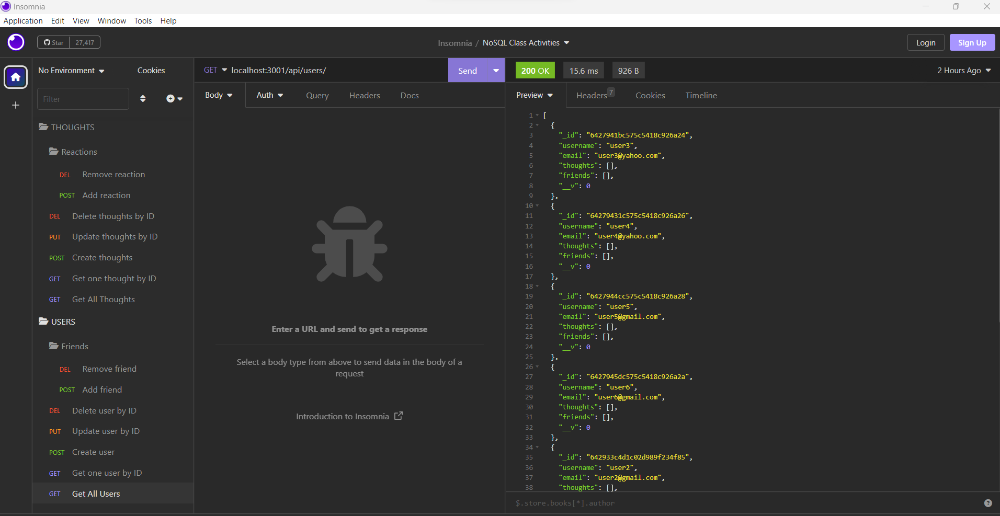

## Title

- NoSQL-Challenge-Social-Network-API

## Table of Contents

- [Title](#title)
- [Description](#description)
- [Technology Used](#technology-used)
- [Installation](#installation)
- [Usage](#usage)
- [Links](#links)
- [License](#license)

## Description

- It's an API for social network web application where users can share their thoughts and react to friends' thoughts and create a friend list.

## Technology Used

- JavaScript
- Node.js
- Express.js
- Mongoose
- MongoDB

## Installation

- To run this application, the above Technologies & npm installation is required locally.

## Usage

- After installing npm packages, the application will be invoked by using the following command:

- ` node server.js`

## Links

- [Walkthroght Video](https://watch.screencastify.com/v/gx8JxlrHaRh1pozfi4o7)
- [Code-Walkthrough-Video](https://watch.screencastify.com/v/utLZf2bsexfOkDGGVD9U)
-
- 

## License

- Covered by
  
